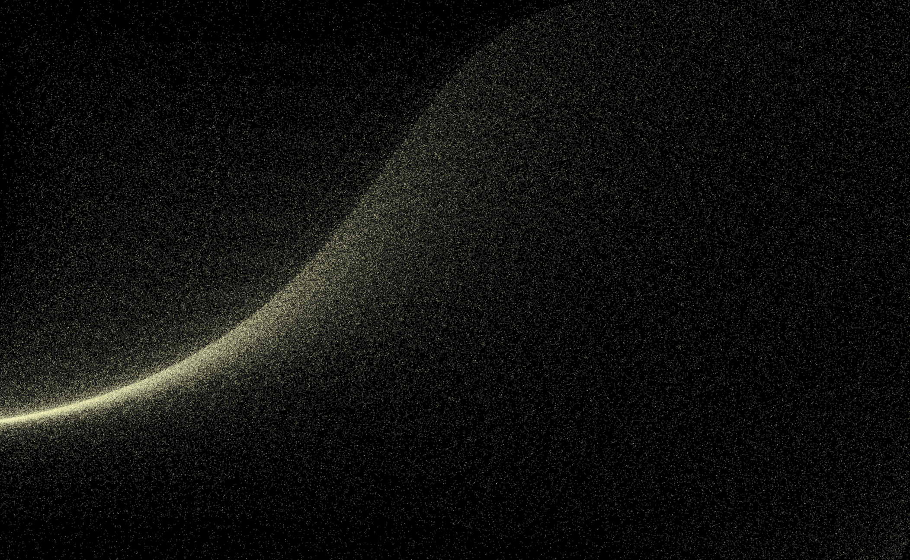
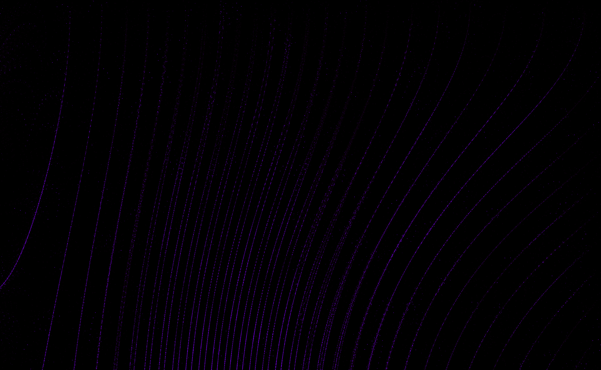
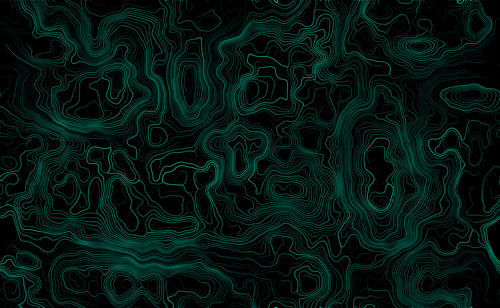
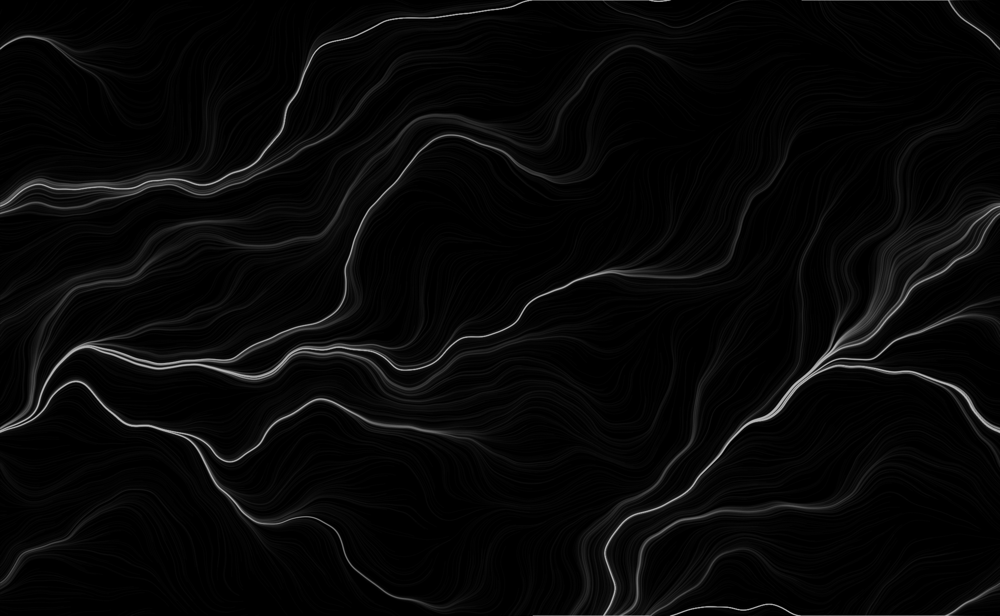

# ADAPTIVE FLOW FIELD

<br> AdaptiveFlowField is a website and a small JS script that allows you to make FlowFields based on perlin noise that can look like this :

<table>
  <tr>
    <td></td>
    <td></td>
  </tr>
  <tr>
    <td></td>
    <td></td>
  </tr>
</table>  

<br> AdaptiveFlowField aims to both let non-coders have fun on the website and find a cool background if they want, and also let coders use the code to implement in their own projects/, portfolios or other things.

<br>

## WHAT'S IN THIS REPO

This repository contains multiple assets to let people start up with flow fields, here is a list of it :
- a <a href="https://chevalmonsieur.github.io/AdaptiveFlowField/">website</a> that shows how the script can be implemented and let you simply ``find your favorite`` flow field
- a commented ``JS script`` including various parameters that can be updated in realtime to easily get your perfect flow field simulation 
- a shorter version of this script ``(17 lines)`` to show that it's not that hard to implement
- this ``README.md`` to explain how everything works

<br>

## HOW TO PUT IT ON YOUR OWN WEBSITE

Get started quickly in 5 simple steps :
- fork this repository anywhere on your computer.
- add these two lines just after the start of your body in HTML :
````
<script src="https://cdnjs.cloudflare.com/ajax/libs/p5.js/1.4.0/p5.min.js"></script>
<script src="main.js"></script>
````
- add a ``<main>`` tag where you want the flow field to appear (a ``<canvas>`` tag will automatically appear and take full width).
- copy the ``main.js`` script in the fork and add it in the same directory as your html file.
- modify the lines 24-28 and 91-95 to make the canva take the height of your choice.
- IT'S DONE !

If you want to set a specific flow field you found on the website, just modify values at the initialisation (first lines of code in ``main.js``) to the one you found with the website.

<br>

## WHAT DO THE VARIABLES CHANGE

here is a list of all the variable in order and their specification :
- ``nbPoints`` : choose how many particles will be drawn each frame in the canvas, make sure the intended audience has a good enough CPU to handle the amount of particles you set (go with values between <b>1000</b> and <b>5000</b> particles to be safe).
- ``speed`` : determines how much distance a particle will cover each frame, a value of one means that a particle will cover one pixel in distance. Bigger values as 30+ makes the canva looks like it's noisy more than each particle is moving (usual values : between <b>0.2</b> and <b>100</b>).
- ``size`` : determines how many pixel in diameter a particle will be (it doesn't have to be an integer) higher values can be a bit CPU intensive and lower values make better flow fields (go with values between <b>0.5</b> and <b>3</b>).
- ``position scale`` : this value represent how much the noise seed will be zoomed in/out, higher values means you focus on 1 or 2 curves, in opposite, lower values means there is a lot of different flows going on (usual values : between <b>25</b> and <b> 2000</b>).
- ``rotation scale`` : this value represent how much a flow can rotate on itself according to the trigonometric circle, a value of one means the field of rotation is between 0 and 2PI. Values lower than one mean that it is impossible for flows to go to certain directions and higher values mean there may be some spirals in the flow field. Try not to have a rotation scale value higher than position scale, it may cause some particles to not move at all (usual values : between <b>0.5</b> and <b>positionScale/2</b>).
- ``opacity`` : determines the opacity of the color of all particles in the flow field, lower values tend to create gradients in color while higher values are sharper. (strict values : between <b>0</b> and <b>255</b>)
- ``fadeSpeed`` : determines how fast the trail of each particle will fade out in the background, a value of 0 will completely deactivate fade effect, low values mean the trail of each particle will be long and higher values mean short tail. If you use fade, don't forget to increase opacity values. (strict values : between <b>0</b> and <b>255</b>).
- ``border rule`` : this string variable decide what happens to particles when they are no longer in the canvas, there are three possible answer to this :
  <br><br> &emsp;&emsp;"randomTeleport", points off-screen get teleported to a random location inside the screen (it is the one I personnally use the most), if your rotation scale is low, it may leave certain positions empty because no flow guides particles to this position.
  <br><br> &emsp;&emsp;"linkedTeleport" : points off-screen are teleported to to the opposite position according to canvas (bottom<->top and left<->right). it is the best to use with low rotation scale because it fills the empty spaces where no flow goes to, however with higher rotation scales, it may cause some visual bugs if opposite position also have opposite flow (if bottom flow goes down and top flow foes up for example).
  <br><br> &emsp;&emsp;"none" or everything else : off-screen points stay off-screen and are still calculated by CPU. it may serve when a specific flow alternate between on/off-screen or when you don't want the simulation to update forever. <br><br>
- ``current color`` : determines the color of the particles, you should modify it through the function inputColor(currentColor, currentColor2), if you modify it manually, make it in this format : ``currentColor = color(v1, v2, v3, opacity)``.
- ``current color 2`` : determines the 2nd color of the particles, set it to null and it will be ignored, you should modify it through the function inputColor(currentColor, currentColor2), if you modify it manually, make it in this format : ``currentColor2 = color(v1, v2, v3, opacity)``. The particles with current color 2 stay the same form one frame to another.

<br>

## LICENSE

<b> Personal License Agreement :</b>

<p align="center" >
  <b>AdaptiveFlowField</b> freely downloaded/used repository for personal and commercial use.
  <br> <br> Do not resell, redistribute in any way without the consent of creator Justin HURSON aka @ChevalMonsieur. 
  <br> <br> By using this repository's content, you agree to these terms.
  <br> <br> Thank you and enjoy!
</p>

<br>

## CONTACT

Linkedin : <a href="https://www.linkedin.com/in/justin-hurson-0794b1253/"> Justin HURSON </a>

Instagram : <a href="https://www.instagram.com/cheval_monsieur/"> cheval_monsieur

Mail : <a href="mailto:just.1et2mii@gmail.com"> just.1et2mii@gmail.com </a>

Discord : mr_cheval

<br>

## THANKS

I would like to thank Vadym Aksieiev from who I used his font NEUTRAL FACE for the title of my website. Contacts below : 
- mail : <a href="mailto:axeev9816@gmail.com"> axeev9816@gmail.com </a>
- instagram : <a href="https://www.instagram.com/axeev/"> @axeev </a>
- behance : <a href="https://www.behance.net/vadymaxeev"> Vadym Aksieiev </a>

Thanks also to <a href="https://github.com/Kikoojap4"> Kikoojap4 </a> who helped me adding functionnalities in my website.
